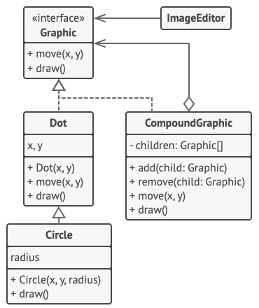

# Composite, also known as object tree.

Composite is a structural design pattern that lets you compose objects into tree structures and then work with these structures as if they were individual objects.

Using the Composite pattern makes sense only when the core model of your app can be represented as a tree.

Use the pattern when you want the client code to treat both simple and complex elements uniformly.

## Pros
- You can work with complex tree structures more conveniently: use polymorphism and recursion to your advantage.
- Open/Closed Principle. You can introduce new element types into the app without breaking the existing code, which now works with the object tree.

## Cons
-  It might be difficult to provide a common interface for classes whose functionality differs too much. In certain scenarios, you’d need to overgeneralize the component interface, making it harder to comprehend.

Detailed example: "https://refactoring.guru/design-patterns/composite"